# CSS
`Inline` css is written in the body and `Internal` style-element inside head tag.
```html
<!--Inline-->
<body>
<h1 style="color: red;">Inline CSS</h1>
</body>

<!--Internal-->
<head>
    <style>
        h2{color: blue;}
    </style>
</head>
<body>
<h1>Internal CSS</h1>
</body>
```

An `External` CSS file with the **.css** extention linked in the head tag using link tag with the rel and href attributes.
```html
<head>
    <link rel="stylesheet" href="/styles.css">
</head>
```
```css
body{
    background-color: rgb(118, 210, 159);
}
p{
    color: white;
    background-color: rgb(9, 113, 113);
}
```

**SELECTORS** Element selectors, Universal selectors, class name, id name.
```css
/*Element selector*/
h1, p, ...{
    color: red;
}
/*Universal selector*/
*{
    color: red;
}
/*Grouping selectors*/
p,h1,h3{
    color: red;
}
/*Id selector*/
#head1{
    color: green;
}
/*Class selector*/
.para1{
    color: rgb(255, 0, 0);
}
```
```html
<h1 id="head1">Id</h1>
<h1 class="head1">Id</h1>
```

**BORDER**<br>
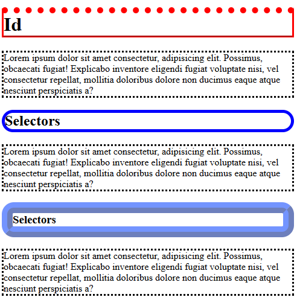<br>

```css
h1{
    border: 10px solid blue; /*Shorthand: width style color*/
}
h2{
    border-style: solid;
    border-width: 5px 20px; /*Top and botoom=5px Right and left=20px*/
    border-width: 5px 10px 15px 20px;
    border-color: red blue violet black; /* top=red right=blue bottom=violet left=black*/
}
h3{
    border-left-style: solid;
    border-top-style: dotted;
    border-bottom-style: groove;
    border-right-style: inset;
    border-top-width: 15px;
    border-color: red;
}
h1{
    border: 5px solid blue;
    border-radius: 20px;
}
h2{
    border: 5mm ridge rgba(19, 68, 227, 0.6); /*ridge*/
    border-radius: 20px;
}
p{
    border-style: dotted;
}
```

**MARGIN** Creating space around an element, pushing it away from other elements or browser. Margin set four sides of an element (top,right,bottom,left). Use different units of measurement.
```css
*{
    margin: 0px;
}
h1{
    margin: 80px 40px 20px 10px; /*Top=80 Right=40 Bottom=20 Left=10*/
    
}
h2{
    text-align: right;
    margin-top: 50px;
    margin-bottom: 20px;
    margin-right: 40px;
    margin-left: 80px;
}

```
```html
<div class="margin"><span>MARGIN</span></div>
```

**PADDING**<br>
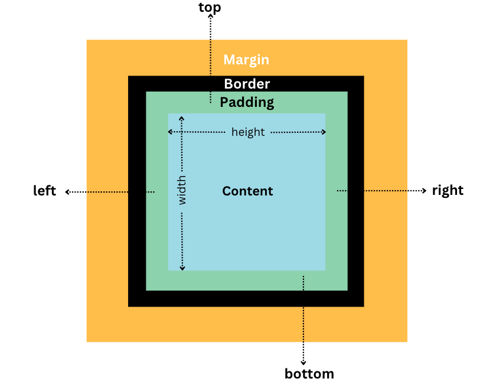<br>

```css
.padding-h2{
    padding: 20px; /*TOP RIGHT BOTTOM LEFT*/
    padding: 20px 50px; /*TOP=20 BOTTOM=20 RIGHT=50 LEFT=50*/
    padding: 10px 50px 80px; /*TOP=10 RIGHT=50 BOTTOM=80 LEFT=50*/
}
.padding-para{
    padding-top: 10px;
    padding-right: 20px;
    padding-bottom: 40px;
    padding-left: 80px;
}
```

**HEIGHT and WIDTH**<br>
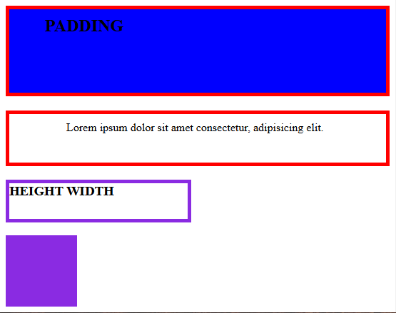<br>

```css
.height-width-h3{
    border: 5px solid blueviolet;
    width: 250px;
    height: 50px;
}

.height-width-div{
    height: 100px;
    width: 100px;
    background-color: blueviolet;
}
```

**OUTLINE**<br>

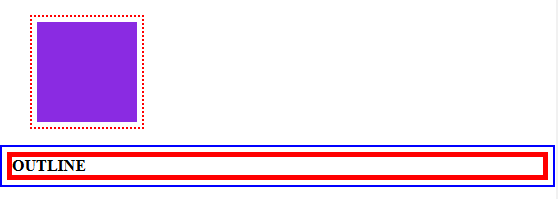<br>

```css
h4{
    border: 5px solid red;
    outline-style: solid;
    outline-width: 2px;
    outline-color: blue;
    outline-offset: 5px;
}
h5{
    outline: 5px dotted red /*outline shorthand*/
    outline-offset: 5px
}
```
Background Image can put in any element
```css
body{
    background-image: url("/images/cat.jpg");
    background-repeat: no-repeat; /*x, y positions*/
    background-position: top right; /* positions*/
    background-attachment: fixed;/*image fixed, scroll*/
    background-size: cover;
}
```

TEXT<br>
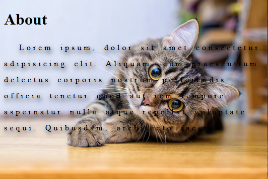<br>

```css
p{
    text-align: center;
    text-decoration: underline;
    text-transform: uppercase;
    text-indent: 30px;
    letter-spacing: 5px;
    line-height: 2;
    word-spacing: 5px;
    text-shadow: 2px 5px 10px black; /*horizontal vertical blur*/
}
```

LIST
```css
list-style-type: square;
list-style-type: upper-alpha; 
ul,ol{
    list-style-position: inside;
}
li{
    border: 1px solid black;
}
```

TABLE<br>
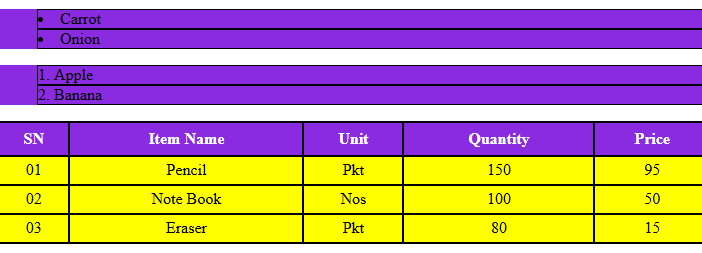<br>
Table Hoover and Odd<br>
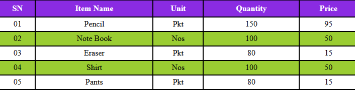<br>

```css
table, th,td{
    border: 2px solid black;
    border-collapse: collapse;
}
table{
    width: 100%;
}
th{
    height: 30px;
    vertical-align: middle;
    background-color: blueviolet;
    color: white;
}
td{
    height: 25px;
    text-align: center;
    /* background-color: yellow; */
}
tr:hover{
    background-color: grey; /*hoover tr !No bgc defined at td*/
}
tr:nth-child(odd){
    background-color: yellowgreen; /*Odd-even !No bgc defined at td*/
}
```

OVERFLOW example div text<br>

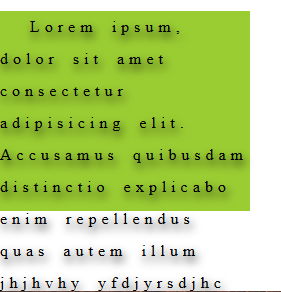
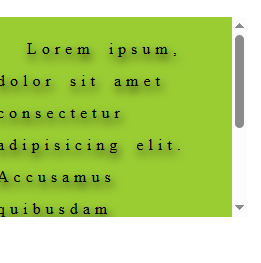<br>

```css
.overflow{
    background-color: yellowgreen;
    width: 250px;
    height: 200px;
    
    overflow: visible;/*default state*/
    overflow: hidden;/*no overflow*/
    overflow: scroll;/*scroll*/
    overflow: auto; /*default scroll*/
}
```

**ABSOLUTE UNITS & RELATIVE UNITS**<br>
ABSOLUTE UNITS:
`px` (pixels), `cm` (centimeters), `mm` (millimeters), `in` (inches), `pt` (points), `pc` (picas): Also<br>
RELATIVE UNITS:
`em`: Relative to the font size of the element itself.
`rem`: Relative to the font size of the root element (`<html>`).
`%` (percentage): Relative to the parent element's size.
`vw` (viewport width), `vh` (viewport height): Relative to the viewport's dimensions.
`vmin`, `vmax`: Relative to the smaller or larger dimension of the viewport, respectively.
`ch`: Relative to the width of the "0" character.
`ex`: Relative to the x-height of the font.

```html
<div class="div-parent-em">
    <p>Paragraph 1</p>
    <div class="div-chil-em"> <!--child inherit fontsize as below mentioned-->
        <p>Paragraph 2</p>  
    </div>
</div>


.div-parent-em{
    font-size: 20px;
}
```
EM
```css
.div-parent-em{
    font-size: 20px;
}
.div-child-em{
    font-size: 2em; /*child double from parent*/
}
```

**`EM`**<br>
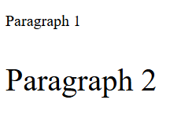<br>

REM
```css
html{
    font-size: 20px;    /*Root value passing through REM EM*/
}
.div-parent-em{
    font-size: 2rem;    /*REM = 2*root */
}
.div-child-em{
    font-size: .5em;    /*.5em half from parent 2rem */
}
```
**VIEWPORT**  is the user's visible area of a web page. Here empty parent child div tag. **PERCENTAGE** relative to the parent element<br>
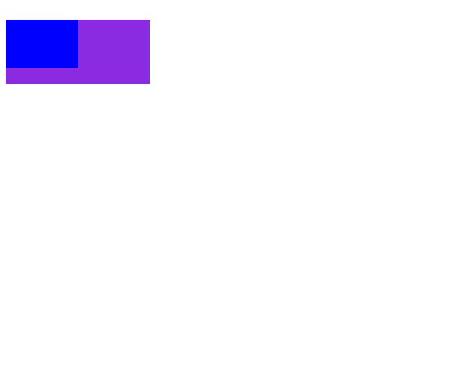<br>

```css
.div-parent-viewport{
    width: 30vw;
    height: 10vh;
    background-color: blueviolet;
}
.div-child-viewport{
    width: 50%;
    height: 75%;
    background-color: blue;
}

<div class="div-parent-viewport">
    <div class="div-child-viewport">
    </div>
</div>
```
**LINK**
```css
<a href="#" class="link1">Google</a>
<a href="#" class="link2">Facebook</a>
<a href="#" class="link3">Instagram</a>

a{
    color: red;
    text-decoration: none;
    cursor: pointer;
    padding: 10px;
}
a:hover{
    color: black;
    background-color: red;
}
```

**POSITIONS**<br>
1.Static - Default, cant change TOP, BOTTOM, LEFT, RIGHT properties.<br>
2.Rlative - it to be adjusted away from its normal position. `Other content will not be adjusted to fit into any gap left by the element`.<br>
3.Absolute -  is positioned relative to the nearest positioned ancestor, if an absolute positioned element has no positioned ancestors, it uses the document body. `Note: Absolute positioned elements are removed from the normal position, and occupied its position by other elements.`<br>
4.Fixed - is positioned relative to the ***viewport***, which means `it always stays in the same place even if the page is scrolled`. The top, right, bottom, and left properties are used to position the element.<br>
5.Sticky - it must stay within it’s containing block (it’s parent)! `Once that containing block scrolls off the page, it leaves with it`.<br>

<br>

```css
<div class="parent-position">
    <div class="child-position1">Relative</div>
    <div class="child-position2">Absolute</div>
    <div class="child-position3">Fixed</div>
    <div class="child-position4">Sticky</div>
</div>

.parent-position{
    width: 300px;
    height: 200px;
    border: 2px solid black;
    margin: auto;
    position: relative; /* position to followed by absolute */
}
.child-position1{
    width: 40px;
    height: 40px;
    background-color: blue;
    margin: 2px;
  /*position: static;    Static or default value*/
  /*top: 10px;           any value wont apply Static or default  */
    position: relative;
    left: 40px;
    top: 25px;
}
.child-position2{
    width: 40px;
    height: 40px;
    background-color: green; 
    margin: 2px;
    position: absolute; /* absolute follows parent position or if not body element*/
    top: 0px;
    right: 10px;
}
.child-position3{
    width: 40px;
    height: 40px;
    background-color: yellowgreen;
    margin: 2px;
    position: fixed; /* fixed at viewport */
    left: 10px;
    top: right;
}
.child-position4{
    width: 40px;
    height: 40px;
    background-color: blueviolet;
    margin: 2px;
    position: sticky; /* sticky only from top 0-pixel */
    top: 0px;
}
```

**DISPLAY :**
HTML element has a default display value block or inline. `Block-level` element always starts on a new line and takes up the full width available **(div, h1, p, form, header, footer, section)**. `Inline` element DOES NOT start on a new line and only takes up as much width as necessary **(span, a, img)**.<br>
`The display property has many values!`, ex: inline, block. `display:none`	The element is completely removed, and the page will be displayed as if the element is not there. `visibility:hidden`  The element will be hidden, will still take up the same space as before.<br>

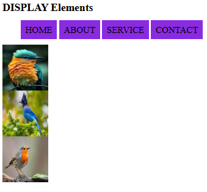<br>

```css
img{
    width: 100px;
    height: 100px;
    display: block; /* img element as block */
}
li{
    display: inline; /* li element as inline */
    padding: 10px;
    background-color: blueviolet;
}

 <ul>
        <li>HOME</li>
        <li>ABOUT</li>
        <li>SERVICE</li>
        <li>CONTACT</li>
    </ul>
    
    
    
```

**FONTS**<br>
`Web safe fonts`: always check how your fonts appear on different browsers and devices, and always use fallback fonts; `Fallback Fonts`: If the first font does not work, the browser will try the next one, and the next one, and so on.<br>
Google Fonts (CDN): add a special style sheet link in the `<head>` section and then refer to the font in the CSS. Multiple Google fonts, just separate the font names with a pipe character `(|)`.

```css
h1{
    font-family: Arial, Helvetica, sans-serif; /*web safe fonts & fallback*/
}
@font-face {
    font-family: "montserrat-light";
    src: url(/fonts/Montserrat-Light.ttf); /*downladed font file*/
}
html{
    font-family: "montserrat-light";
}
/*multiple fonts through content delivery network*/
<link rel="" href="https://fonts.googleapis.com/css?family=Audiowide|Sofia|Trirong"> 
```

RADIUS<br>
first value applies to top-left corner, second value applies to top-right corner, third value applies to bottom-right corner, and fourth value applies to bottom-left corner.<br>

<br>

```css
.radius1{
    background-color: blueviolet;
    height: 100px;
    width: 100px;

    border-radius: 50px; /*radius circle*/

    border-radius: 0px 40px 0px 40px; /*shorthand top-right, top-left, bottom-right, bottom-left*/

    border-top-right-radius: 40px; /*individual corner*/
    border-bottom-left-radius: 40px;
}
```
PSEUDO-CLASS<br>
A Pseudo-class selects elements that are in a specific state/condition.<br>
**`:hover`** = Applies styles when the user hovers over an element.
**`:active`** = Applies styles when an element is being activated (e.g., clicked).
**`:focus`** = Applies styles when an element has focus (e.g., an input field being typed in).
**`:link`** = Applies styles to unvisited links.
**`:visited`** = Applies styles to visited links.

<br>

```css
.div-hover1:hover{ /*Hover*/
    color: red;
    font-size: 40px;
}

.div-active1:active{ /*Active */
    color: blue;
    background-color: red;
    font-style: italic;
}
input:focus{ /*Focus input-text*/
    background-color: blueviolet;
    border: 5px solid yellow ;
}
/*Link not visited*/
a:link{
    color: red;
}
/*Visited the user has visited*/
a:visited{
    color: green;
}
```

PSEUDO-ELEMENT<br>
Pseudo-elemnt style a specific part of the selected elements.<br>
**`::first-line`**
**`::first-letter`**
**`::before`**
**`::after`**
**`::selection`**

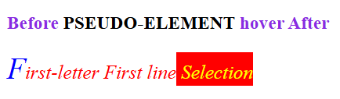<br>

```css
.pseudoelement-para::first-line{ /*::first-line*/
    color: red;
    font-size: 20px;
    font-style: italic;
}
.pseudoelement-para::first-letter{ /*::first-letter*/
    color: blue;
    font-size: 30px;
}
.pseudoelement-h3::before{ /*::before*/
    content: "Before ";
    color: blueviolet;
}
.pseudoelement-h3:hover::after{ /*::after*/
    content: " hover After";
    content: url(/images/bird1.png); /*can add icon and pics*/
}
.pseudoelement-para::selection{ /*::selection*/
    color: yellow;
    background-color: red;
}
```

**GRADIENT** Combination of colors
linear-gradient: side
radial-gradient: center

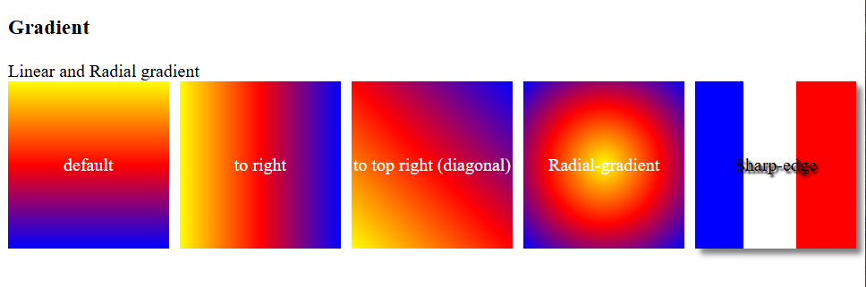<br>

```css
.gradient-child1{
    background-image: linear-gradient( yellow, red, blue); /*default top to bottom*/
}
.gradient-child2{
    background-image: linear-gradient(to right , yellow, red, blue);
}
.gradient-child3{
    background-image: linear-gradient(to top right , yellow, red, blue);/*diagonal*/
}
.gradient-child4{
    background-image: radial-gradient( yellow, red, blue); /*Radial*/
}
.gradient-child5{       /*sharp edge*/
    color: black;
    text-shadow: 2px 2px 5px;
    box-shadow: 5px 5px 5px rgba(0, 0, 0, 0.5);
    background-image: linear-gradient(
        to right,
        blue 0px 30%,
        white 30% 63%,
        red 63% 100%
    );
}


.gradient-parent{
    display: flex;
    gap: 10px;
}
.gradient-child1,
.gradient-child2,
.gradient-child3,
.gradient-child4,
.gradient-child5 {
    height: 150px;
    flex: 1;
    display: flex;
    justify-content: center;
    align-items: center;
    color: white;
}
```

**TRANSFORM** 2D<br>
CSS transforms allow you to move, rotate, scale, and skew elements.<br>
`transform: translate(20px, 50px)` The translate() method moves an element from its current position.<br>
`rotate()` positive values clockwise negative values will rotate the element counter-clockwise.<br>
`scale()` increases or decreases the size of an element for the width and height.<br>
`skew()` skews an element along the X-axis and Y-axis by the given angle.<br>
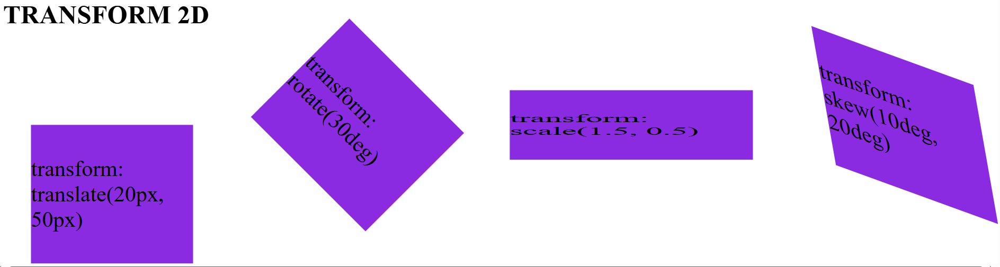<br>

```css
.transform-child1{
    width: 100px;
    height: 100px;
    background-color: blueviolet;

    transform: translate(20px, 50px); /* x,y axis push away */

    transform: rotate(45deg); /* clockwise (positive) & anticlockwise (negative)*/

    transform: scale(1.5, 0.5); /* size multiply/decrease width scacleX(), height scaleY()*/

    transform: skew(10deg, 20deg); /* x, y axis or skewX() skewY()*/
}

.transform-parent{
    display: flex;
    gap: 80px;
}
.transform-child1,
.transform-child2,
.transform-child3,
.transform-child4 {
    width: 100px;
    height: 100px;
    background-color: blueviolet;
    flex: 1;
    display: flex;
    justify-content: center;
    align-items: center;
}
```

**TRANSITION** <br>
Transitions allows to change property values smoothly, over a given duration.<br>

hover: transform, size <br>

transition: time sizetime <br>
transition-timing-function: ease default(slowstart-speed-endslow), linear(startend constant speed), ease-in(slowstart endspeed), ease-out(speedstart slowend) <br>
transition-delay: 1s <br>
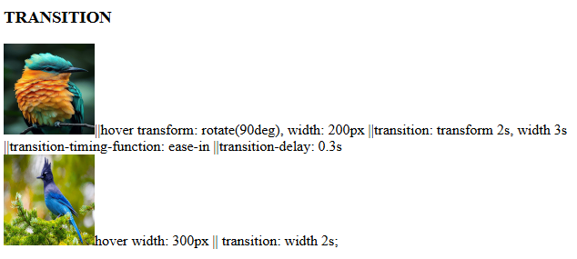<br>

```css
/*TRANSITION 1*/
.transition-image-bird1{
    width: 100px;
    height: 100px; 

    transition: transform 2s, width 3s;
    transition-timing-function: ease-in;
    transition-delay: 0.3s;
}
.transition-image-bird1:hover{
    transform: rotate(360deg);
    width: 200px;
    height: auto;
}
/*TRANSITION 2*/
.transition-image-bird2{
    width: 100px;
    height: 100px;

    transition: width 2s;
}
.transition-image-bird2:hover{
    width: 300px;
}
```

**ANIMATION** <br>
`animation-timing-function` **ease** slow start then speed slow end, **linear** - start to end same speed, **ease-in** slow start, **ease-out** slow end <br>

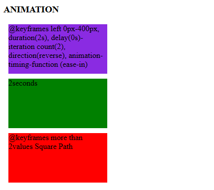<br>
<video src="video/transitionAnimation-video.mp4" width="540" height="360" controls></video><br>


```css
.animation-child1,
.animation-child2,
.animation-child3{
    width: 200px;
    height: 100px;
    margin: 10px;
    position: relative; /*relative*/
}
.animation-child1{
    background-color: blueviolet;
    animation-name: fromLeftMovingAnimation; /*1 keyframe name*/
    animation-duration: 2s; /*1 define duration*/
    animation-delay: 0s; /*waiting*/
    animation-iteration-count: 2;
    animation-direction:reverse;
    animation-timing-function: ease-in;
}
.animation-child2{
    background-color: green;
    animation: fromLeftMovingAnimation 2s; /*shorthand animname duration*/
}
@keyframes fromLeftMovingAnimation{
    0%{ /*starting point*/
        left: 0px;
        border-radius: 0px;
    }
    100%{ /*end point*/
        left: 400px;
        border-radius: 50px;
    }
}

/*keyframe square path more than 2values*/
.animation-child3{
    background-color: red;
    animation: squareMovingAnimaton 4s infinite;
}
@keyframes squareMovingAnimaton{
    0% { left: 0px; top: 0px; }
    25% { left: 250px;top: 0px; }
    50% { left: 250px;top: 250px; }
    75% { left: 0px;top: 250px; }
    100% { left: 0px;  top: 0px; }
}
```

**VARIABLE**
`var() function`, CSS variables can have a global or local scope, CSS variables have access to the DOM, change the variables with JavaScript, and change the variables based on media queries. Varible in body element is globel scope. Both of them are global<br>
The `<html>` element (represented by `:root`) is the highest-level element in the document.
The `<body>` element is a child of the <html> element. <br>

```css
:root{
    --textcolor1: rgb(174, 87, 87); /*globel scope*/
}
h1,h2{
    color: var(--textcolor1);
    --textcolor2: blue; /*block scope*/
}
h3{
    color: var(--textcolor2);
}
```